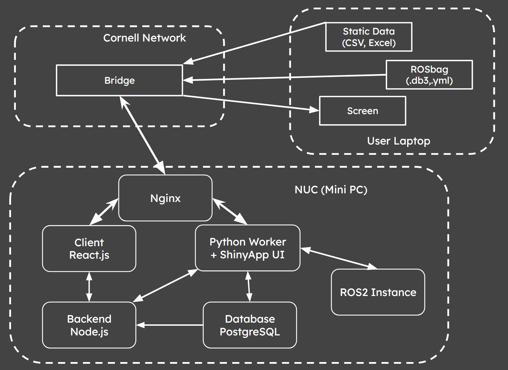

# Cross-Team Analysis Toolbox

## Team Members
Ajay Parthibha, Amelia Zheng, Rhea Agrawal

## Summary
The Cross-Team Analysis Toolbox is an interactive visualization platform designed to support the Mechanical, Electrical, and Autonomy subteams in analyzing vehicle performance data. 

It provides two core functionalities: 
- Dynamic Analysis: Visualizes recorded ROS bag data
- Static Analysis: Parses and visualizes CSV and ROS bag data, creating dynamic plots
  
The project is fully dockerized for easy deployment and can be hosted locally within the ELL environment.

## Design Flow 
User uploads ROSBag or CSV files via the web interface.
Files are parsed and stored in PostgreSQL, and available for users to select from a dropdown menu.
Workflows are divided into:
- Dynamic Analysis → ROSBag replay and 3D visualizations
- Static Analysis → CSV data plots and statistics

## How to Use 
1. Clone the repository
2. Run ```docker-compose up --build```

## Application Architecture


### Frontend
- React.js: Displays visualizations, manages user interactions, and communicates with backend APIs.
- Shiny for Python: Provides the static visualization interface for CSV and parsed ROSBag data### Backend
Python, Node.js, Express.js, PostgreSQL

### Backend
Python (PyWorker):
- Parses CSV and ROSBag data.
- Handles database uploads and data formatting.
Node.js + Express.js:
- Manages routing and server endpoints.
- Interfaces with PostgreSQL for data retrieval.
PostgreSQL:
- Stores parsed CSV and ROSBag data 
### Usage

